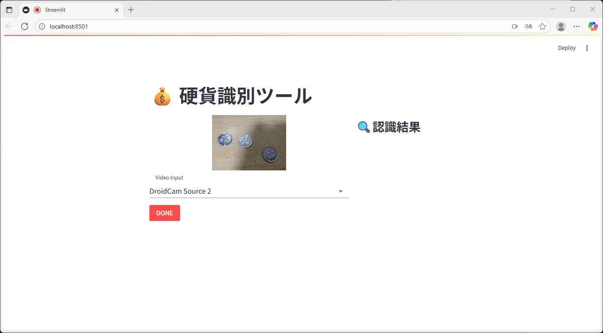
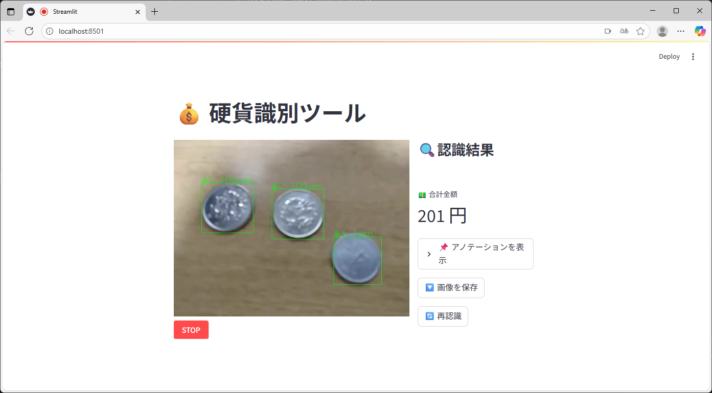
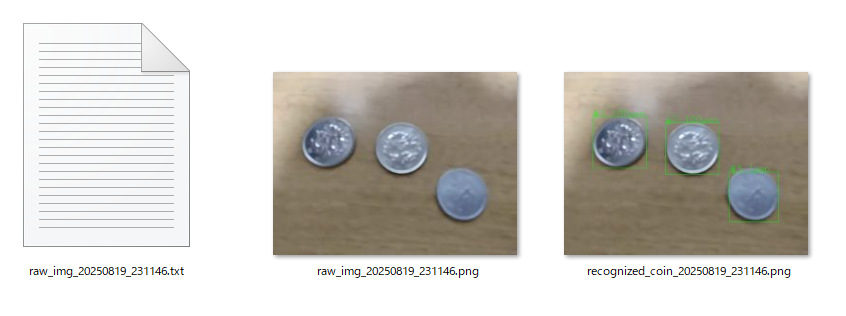

# 硬貨分類器 (Coin Classifier)

## 1. プロジェクト概要

このプロジェクトは、PCのWebカメラ映像から**日本の硬貨をリアルタイムで識別し、合計金額を算出する**Webアプリケーションです。開発者のポートフォリオとして、企画から設計、実装、テストまでの一連のプロセスを実践しています。

PCのWebカメラから硬貨を認識するために、機械学習モデル **YOLO11n** をファインチューニングして使用しています。ユーザーインターフェースには **Streamlit** を採用し、リアルタイムでの硬貨識別と合計金額の表示を実現します。

プロトタイプ段階では、色の特徴が似ている**1円玉**と**100円玉**を識別対象とすることで、機械学習のベンチマークを行っています。

要件定義と仕様は以下のリポジトリ内wikiに記載しています。
- [要件定義書](https://github.com/daisukekushima/coin_classifier/wiki/01_%E8%A6%81%E4%BB%B6%E5%AE%9A%E7%BE%A9%E6%9B%B8)
- [仕様書](https://github.com/daisukekushima/coin_classifier/wiki/02_%E4%BB%95%E6%A7%98%E6%9B%B8)

## 2. 主な機能

- **リアルタイム硬貨識別**: Webカメラの映像から硬貨をリアルタイムに検出し、バウンディングボックスと種類（1円/100円）を表示します。
- **合計金額の自動算出**: 画面内に検出された硬貨の合計金額をリアルタイムで計算し、表示します。
- **結果の保存**: 認識結果の画像と、機械学習用のYOLO形式アノテーションデータをローカルに保存できます。
- **アノテーション作業の補助 (開発者向け)**: `annotation_assist.py` を実行すると、既存モデルが画像から物体検出し、アノテーションファイルの雛形を自動生成します。
- **モデルの再学習 (開発者向け)**: `finetuning.py` を使用して、独自のデータセットでモデルを再学習できます。

## 3. 技術スタック

- **言語**: Python 3.11
- **モデル**: Ultralytics YOLO11n
- **ライブラリ**: `requirements.txt` を参照

## 4. ディレクトリ構成

```
├── app.py                             # 硬貨認識のコアロジック
├── streamlit_run.py                   # Streamlitアプリケーションのメインスクリプト
├── finetuning.py                      # YOLOv11モデルのファインチューニング用スクリプト
├── annotation_assist.py               # アノテーション生成の補助ツール
├── setup_env.bat                      # 仮想環境のセットアップ用バッチファイル
├── streamlit_run.bat                  # Streamlitアプリの起動用バッチファイル
├── requirements.txt                   # 依存ライブラリ一覧
├── datasets/                          # データセット
│   ├── data.yaml                      # データセットの構成ファイル (クラス名、パス定義)
│   ├── images/                        # 画像ファイル (train/val)
│   └── labels/                        # アノテーションファイル (train/val)
├── finetuning_result/                 # ファインチューニング結果の出力先
│   └── yolo11n/
│       ├── best.pt                    # 最も性能が良かったモデルの重みファイル
│       ├── best_config_…              # 最も性能が良かったモデルのオーグメンテーションの条件を表したファイル
│       └── augmentation_summary.csv   # データオーグメンテーション全組み合わせの評価結果
└── classifier_result/                 # アプリケーションで保存した認識結果の出力先
```

## 5. セットアップ手順

### 5.1. 前提条件

- **Python 3.11** がインストールされていること。（`setup_env.bat` は `py -3.11` コマンドを使用します）
- **git**がインストールされていること。（リポジトリのダウンロードに git clone コマンドを使用します。）
- **Windows**環境であること（仮想環境の構築に `setup_env.bat` を使用します。）
  - 他のOS（**Linux / macOS**）の場合、手動で仮想環境を作成してください。

### 5.2. 手順

1. **リポジトリのクローン**:  
   現在開発中のブランチissue_004を指定してリポジトリをクローンします。
   ```bash
   git clone -b issue_004 https://github.com/daisukekushima/coin_classifier/tree/issue_004
   cd coin_classifier
   ```

2. **環境構築**:  
   リポジトリのルートで `setup_env.bat` を実行します。  
   これにより、`.env_coin_classifier` という名前のPython仮想環境が作成され、必要なライブラリが自動でインストールされます。
   ```bash
   setup_env.bat
   ```

3. **仮想環境のアクティベート**:  
   作業をする際は、以下のコマンドで仮想環境を有効化してください。
   ```bash
   .env_coin_classifier\Scripts\activate
   ```

## 6. 使用方法

### 6.1. アプリケーションの実行と操作

1. **アプリケーションの起動**

   `streamlit_run.bat` を実行するか、コマンドプロンプト（ターミナル）で以下のコマンドを実行します。

   ```bash
   # 仮想環境をアクティベートした後
   streamlit run streamlit_run.py
   ```

2. **カメラの準備**

   - 起動後、ブラウザでアプリが開きます。下図赤枠のようにカメラ許可のポップアップが表示される場合は、カメラへのアクセスを許可してください。

   
   


   - `SELECT DEVICE` プルダウンから使用するカメラを選択し、`START` ボタンを押すと認識が開始されます。


   


3. **認識と結果表示**

   - 硬貨が認識されると、カメラ映像が停止し、検出結果（バウンディングボックス、合計金額）が表示されます。
   - `🔄 再認識` ボタンを押すと、再度カメラが起動し、認識を再開できます。


   


4. **結果の保存 (任意)**


   - `🔽 データ保存` ボタンを押すと、認識時の画像とYOLO形式のアノテーションデータが `classifier_result/` ディレクトリに保存されます。

   
    
   
   - 保存されたデータは、後述のデータセット拡充に利用できます。
   - 保存されるファイル形式は、後述する**3. 結果確認と修正** で生成されるものと同じ形式です。
   - データセット追加についての詳細な確認や修正方法については、**3. 結果確認と修正** および **4. ファイル配置** を参照してください。

5. **終了**

   - `STOP` ボタンを押してカメラを停止します。
   - アプリケーションを完全に終了するには、コマンドプロンプト（ターミナル）で `Ctrl+C` を押すか、ウィンドウを閉じてください。

### 6.2. 開発者向け機能

#### 1. アノテーションの補助・データセット追加

新しい画像をデータセットに追加する際、`annotation_assist.py` を使ってアノテーション作業を効率化できます。

1. **パス設定**: `annotation_assist.py` を開き、`IMG_PATH` 変数に対象画像のパスを設定します。
   ```python
   # 例
   IMG_PATH = ROOT_DIR / "datasets/images/train/new_image.jpg"
   ```

2. **スクリプト実行**: コマンドプロンプト（ターミナル）で以下のコマンドを実行します。
   ```bash
   # 仮想環境をアクティベートした後
   python annotation_assist.py
   ```

3. **結果確認と修正**:
   - 元の画像と同じ場所に、アノテーションファイル (`new_image.txt`) と、検出結果を描画した確認用画像 (`new_image_annotated.jpg`) が生成されます。
   - 確認用画像のバウンディングボックスと番号を確認しながら、必要に応じて `.txt` ファイルを修正してください。

4. **ファイル配置**: 新しい画像を `datasets/images/train/` や `datasets/images/val/` に配置します。アノテーションファイルは対応するディレクトリに配置します。

#### 2. モデルのファインチューニング

データセットを更新した後、`finetuning.py` を使ってモデルを再学習します。

1. **スクリプト実行**: コマンドプロンプト（ターミナル）で以下のコマンドを実行します。
   ```bash
   # 仮想環境をアクティベートした後
   python finetuning.py
   ```

2. **処理内容**:
   - スクリプトは、複数のデータオーグメンテーションの組み合わせを試し、それぞれの精度を評価します。
   - 全ての試行が完了すると、最も性能の良かったモデルが選出されます。

3. **結果の確認**:
   - 最も性能の良かったモデルの重みは `finetuning_result/yolo11n/best.pt` として保存され、アプリケーションで自動的に使用されます。
   - 各データ拡張設定での評価結果は `finetuning_result/yolo11n/augmentation_summary.csv` に記録されます。
